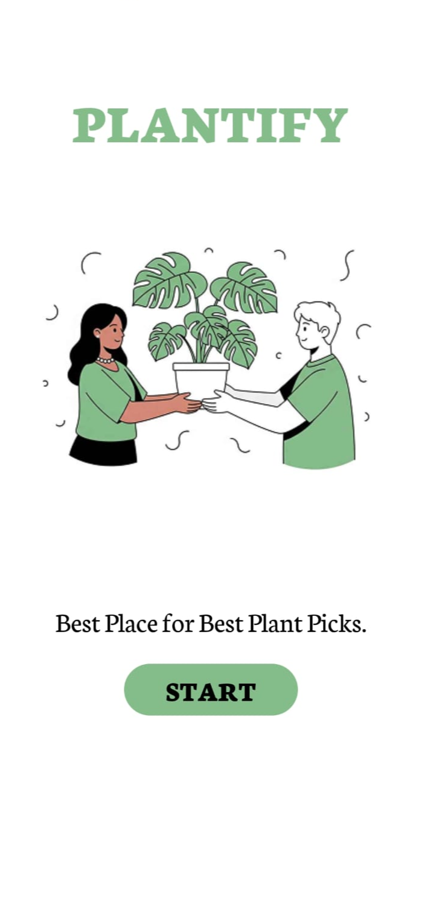
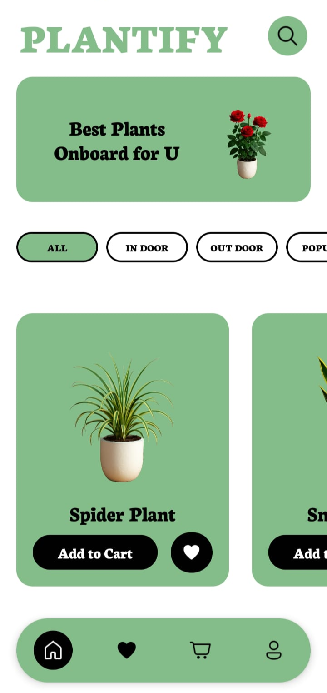
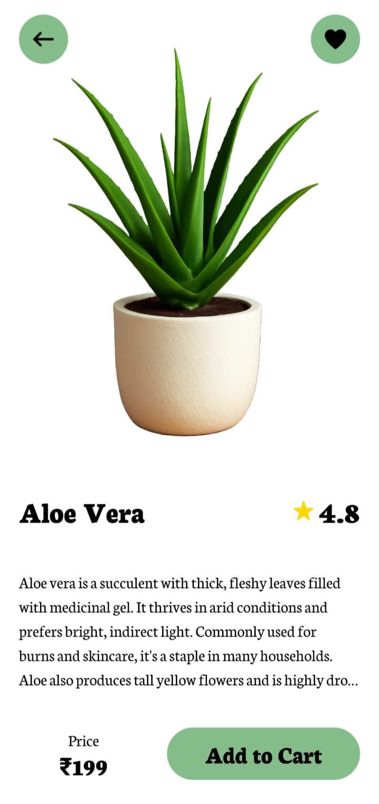
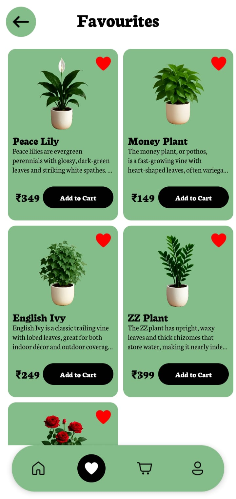
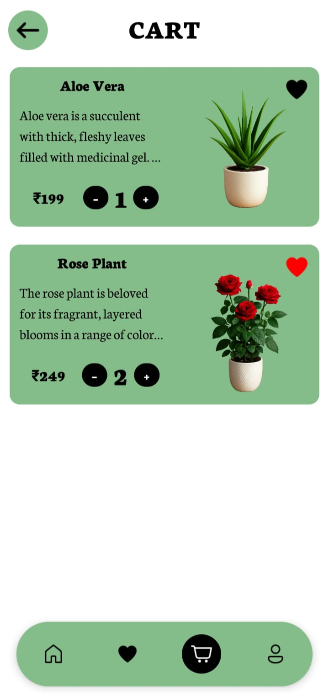

# PLANTIFY 🪴

**Your one-stop destination for all things green and growing**

Plantify is a beautiful and intuitive **React Native mobile application** that brings the joy of plants right to your fingertips. Whether you're a seasoned plant parent or just starting your green journey, Plantify offers a delightful shopping experience to explore and fall in love with plants.

---

## 🚀 Get Started

**For Developers**

> ```bash
> # Clone the repository
> git clone https://github.com/Bharath-2101/Plantify.git
>
> # Navigate into the project directory
> cd plantify
>
> # Install dependencies
> npm install
>
> # Start the app on emulator or device
> npx expo start
> ```

---

## 📱 Demo

Explore the app in action!

> **Screenshots:**  
>      
> _(Include screenshots of key screens in the `/assets/demo/` folder)_

---

## 🎨 Features

- 🌿 Explore a curated list of beautiful plants
- 🛒 Add plants to your cart (frontend only)
- ❤️ Mark favorites
- ✨ Beautiful and responsive UI
- ⚡ Built with Expo for fast development

---

## 🧑‍💻 Tech Stack

- **Framework:** [React Native](https://reactnative.dev/)
- **Bundler:** [Expo](https://expo.dev/)
- **UI:** Custom components with [StyleSheet]
- **Icons:** [React Native Vector Icons](https://github.com/oblador/react-native-vector-icons)
- **Navigation:** [React Navigation](https://reactnavigation.org/)

---

## 📁 Folder Structure

```plaintext
plantify/
├── assets/              # Images, fonts, and icons
├── components/          # Reusable UI components
├── screens/             # App screens (Home, Details, Cart, etc.)
├── constants/           # Color schemes, fonts, and data
├── App.js               # Root app file
└── package.json         # Project metadata and scripts
```
